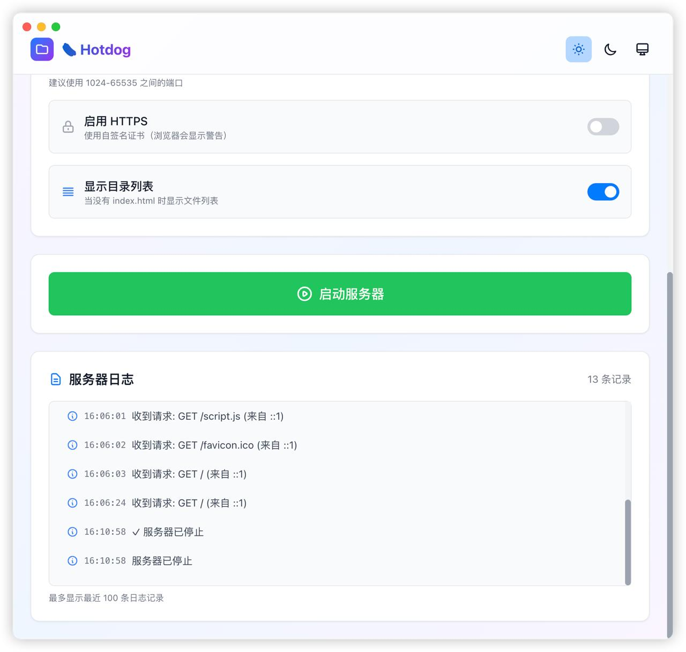
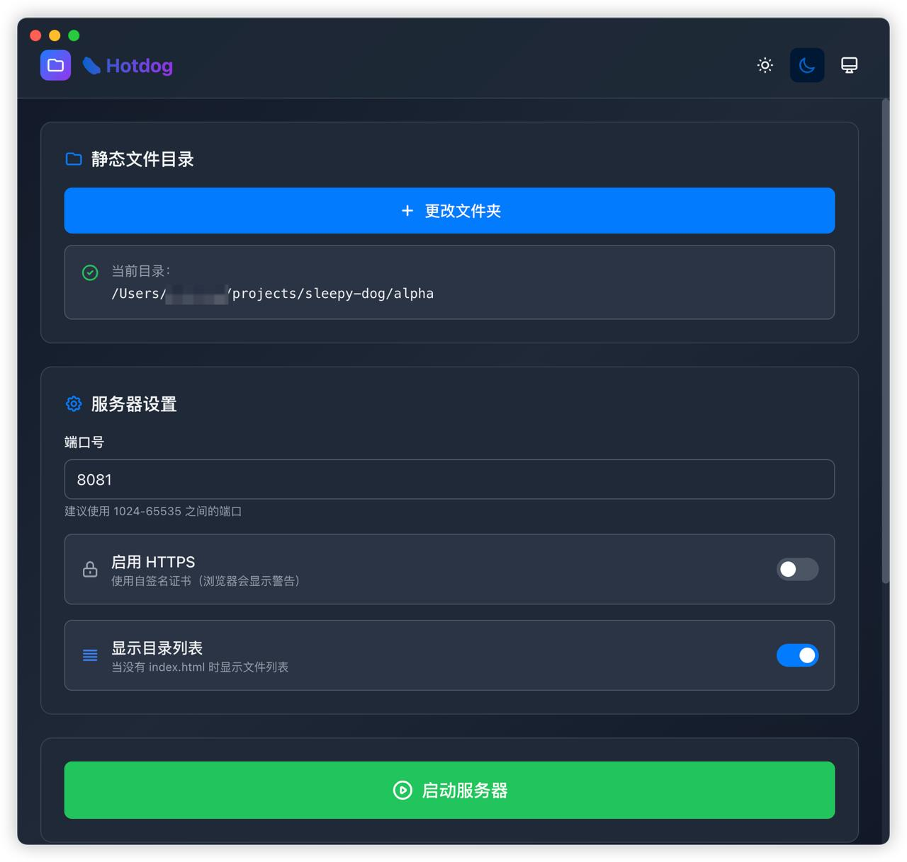
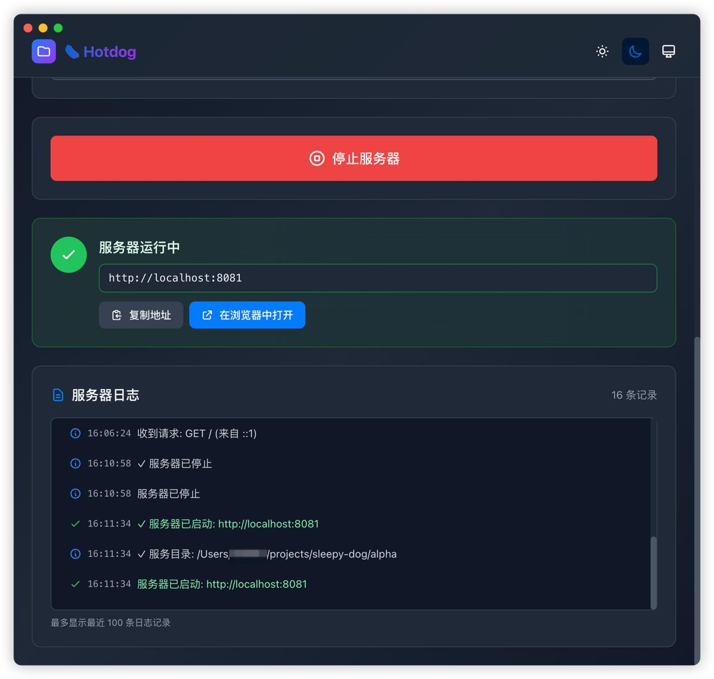

# 🌭 Hotdog

一个现代化、极简、美观的本地静态文件服务器桌面应用，使用 Electron + Vite + React 构建。

## 🌐 在线演示

访问我们的 [Landing Page](./landing-page) 了解更多信息并下载应用。

## 📸 界面预览

### 浅色主题

<div align="center">
  
  
</div>

### 深色主题

<div align="center">
  
  
</div>

## ✨ 功能特性

- 📁 **文件夹选择** - 选择任意文件夹作为静态服务根目录
- 🚀 **快速启动** - 一键启动/停止本地HTTP服务器
- ⚙️ **灵活配置**
  - 自定义端口（默认8080）
  - 支持HTTPS（自签名证书）
  - 目录列表开关
- 🎨 **现代UI设计**
  - 极简美观的界面
  - 支持深色/浅色/跟随系统主题
  - 平滑动画和过渡效果
- 📝 **实时日志** - 显示服务器状态和访问请求
- 🔄 **热重载(HMR)** - 开发模式下支持代码热更新
- 💾 **持久化设置** - 自动保存上次使用的配置
- 🌐 **跨平台** - 支持 Windows、macOS、Linux

## 🛠️ 技术栈

- **Electron** - 跨平台桌面应用框架
- **Vite** - 快速构建工具，支持HMR
- **React** - 前端UI框架
- **Tailwind CSS** - 实用优先的CSS框架
- **electron-store** - 持久化存储
- **serve-handler** - 静态文件服务处理器

## 📦 安装和使用

### 开发环境要求

- Node.js >= 18
- pnpm >= 8（推荐）或 npm >= 9

### 安装依赖

```bash
# 使用 pnpm（推荐）
pnpm install

# 或使用 npm
npm install
```

### 开发模式（支持HMR）

```bash
pnpm dev

# 或
npm run dev
```

这将启动Vite开发服务器并打开Electron应用。在开发模式下：

- **React组件热更新**：修改任何`.jsx`文件，界面会自动刷新
- **样式热更新**：修改CSS文件，样式立即生效
- **主进程热重启**：修改主进程代码会自动重启应用
- **DevTools自动打开**：方便调试

### 构建生产版本

```bash
pnpm build

# 或
npm run build
```

### 打包应用

```bash
# 打包所有平台
pnpm package

# 仅打包 Windows
pnpm package:win

# 仅打包 macOS
pnpm package:mac

# 仅打包 Linux
pnpm package:linux
```

打包后的文件会输出到 `release/` 目录。

## 🎯 使用说明

### 基本流程

1. **选择文件夹** - 点击"选择文件夹"按钮，选择包含静态文件的目录
2. **配置服务器** - 设置端口号、HTTPS、目录列表等选项
3. **启动服务器** - 点击"启动服务器"，应用会自动在浏览器中打开
4. **访问文件** - 在浏览器中访问 `http://localhost:端口号`
5. **停止服务器** - 点击"停止服务器"或关闭应用

### HTTPS 说明

启用HTTPS时，应用会自动生成自签名证书。浏览器会显示安全警告，这是正常现象。

**注意**：
- 自签名证书仅用于本地开发测试
- 默认仅监听 localhost，不对外暴露

### 目录列表

启用后，当访问的目录没有 `index.html` 时会显示文件列表。

## 📁 项目结构

```
hotdog/
├── src/
│   ├── main/                 # Electron主进程
│   │   ├── index.js         # 主进程入口
│   │   └── server.js        # HTTP服务器逻辑
│   ├── preload/             # 预加载脚本
│   │   └── index.js         # IPC桥接
│   └── renderer/            # 渲染进程（React应用）
│       ├── index.html       # HTML入口
│       └── src/
│           ├── main.jsx     # React入口
│           ├── App.jsx      # 主应用组件
│           ├── components/  # UI组件
│           └── styles/      # 样式文件
├── demo-site/               # 演示站点
├── electron.vite.config.js  # Electron Vite配置
├── tailwind.config.js       # Tailwind配置
└── package.json             # 项目配置
```

## 🔧 开发指南

### 主要组件

- **FolderSelector** - 文件夹选择器
- **Settings** - 服务器设置（端口、HTTPS、目录列表）
- **ServerControls** - 启动/停止按钮
- **StatusDisplay** - 服务器状态显示
- **LogViewer** - 日志查看器

### IPC 通信

- `select-folder` - 选择文件夹
- `start-server` / `stop-server` - 控制服务器
- `get-server-status` - 获取状态
- `open-browser` - 打开浏览器
- `server-log` - 日志推送

## 🐛 常见问题

### 端口被占用
更改为其他端口（如8081、3000等）

### HTTPS证书警告
点击"高级" → "继续访问"即可

### 应用无法启动
删除 `node_modules` 并重新安装

### HMR不工作
确保使用 `pnpm dev` 启动

## 📝 更新日志

### v1.0.0 (2025-12-31)
- ✨ 初始版本发布
- 🎨 现代化UI设计
- 🔄 完整的HMR支持
- 📦 跨平台打包支持

## 📄 许可证

MIT License

## 👤 作者

Hoan

---

**提示**：如果觉得这个项目有帮助，请给个⭐️Star！

## ⚠️ 关于pnpm

**重要提示**：在Node.js v24环境下，pnpm可能会遇到内存溢出问题。

### 推荐方案：

1. **使用npm**（已验证可用）：
   ```bash
   npm install
   npm run dev
   ```

2. **或降级到Node.js v20 LTS后使用pnpm**：
   ```bash
   nvm install 20
   nvm use 20
   pnpm install
   pnpm dev
   ```

详细说明请查看 [PNPM_NOTES.md](./PNPM_NOTES.md)
